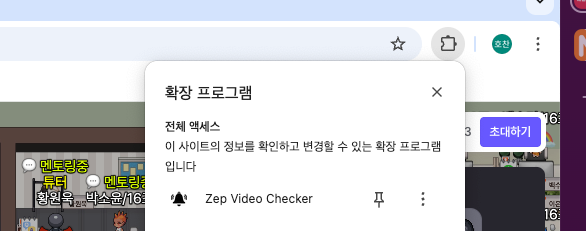
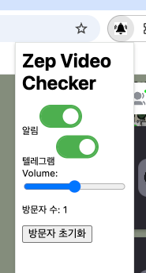

# Zep Video Checker
Zep 화면에서 video 갯수를 확인하여 알림을 줍니다.

## 기능
- on off
- 볼륨 조절

## 등록하는 법
1. chrome://extensions/ 로 이동
2. 우측 상단의 개발자 모드를 켜주세요.
3. "압축해제된 확장 프로그램을 로드합니다" 를 누르고 이 프로젝트를 선택합니다.

### 유의사항
- 크롬 동작만 확인하였습니다.
- 기본 볼륨 설정이 0.5 인데 확인해보시고 content.js > videoAlarmSound.volume 값 수정, popup.html > volumeSilider의 기본 값 수정하셔서 사용하시면 될 것 같습니다.

### 텔레그램
- [content.js](content.js) 에서 텔레그램 값 수정
- 상단의 {{BOT_TOKEN}}, {{CHAT_ID}} 를 본인에 맞게 수정해주세요
- [참고사항](https://blog.naver.com/lifelectronics/223198582215)
- 텔레그램은 동일 방문자는 10분동안 다시 울리지않습니다.
- 
- 방문자 초기화 하면 다시 초기화되어 알람이 울립니다.
- 